# Dataset Transfer & Assembly Workspace


[](https://github.com/mekala-2405/transfers)

Tooling for downloading raw LeRobot datasets from Hugging Face, curating and
balancing them locally, and exporting a verified LeRobot v2.1 dataset.

## Walkthrough video

Auto-generated screen tour of the full pipeline — source discovery,
camera & joint mapping, episode curation, balancing, preflight, and export —
recorded against the real `dataset/` folder (3 datasets, 20 usable episodes).

<video controls src="docs/walkthrough/output.mp4" width="720"></video>

*Stills for each scene live in `docs/walkthrough/shots/`; a timestamped
transcript is in `docs/walkthrough/TRANSCRIPT.md`.*

## Contents

- `dataset_studio/` — **Dataset Assembly Studio**, a local web app that
  discovers LeRobot datasets, reviews and curates episodes, balances the
  combined selection, and exports a normalized v2.1 dataset.
- `downloader.py` — single-shot Hugging Face dataset downloader.
- `downloader_v2.py` — rate-limit-safe downloader that can resume failed
  datasets or fetch new repositories by name.
- `docs/` — detailed design docs, a walkthrough guide, the walkthrough video,
  and its screenshots.
- `site/` — a static preview site with sample episodes from the curated and
  exported datasets.

## Features

Click each area to expand the details.

<details>
<summary><b>Source discovery, validation, and flags</b></summary>

- Recursively discovers LeRobot datasets under a common root and validates
  them (Parquet, metadata, cameras, episode duration) before they can be used.
- Header metrics show `datasets / valid / usable episodes`; a **Find a dataset**
  search filters by name, task, camera, and more.
- Each dataset card reports version, FPS, camera count, usable episodes, and its
  validation status — `ready` or `quarantined` (with the reason spelled out).
- Cards are grouped by source folder and expose **Claim & open**, **Save
  draft**, **Approve checkpoint**, **Exclude…**, **History**, and **Release
  claim** actions.
- **Flags** define reusable tags (`Ctrl+1`…`Ctrl+9` on a hovered card) that
  follow a dataset into its checkpoint.
</details>

<details>
<summary><b>Output contract</b></summary>

- Configure the dataset folder name and output parent directory; existing
  destinations are never overwritten.
- `wrist` is always fixed and mandatory; the second camera is selectable
  (default `front`).
- Optional project-wide **maximum episodes per edited task** applied
  deterministically in Balance/Preflight.
- Changing the second camera marks preflight stale and flags every approved
  dataset for remapping.
</details>

<details>
<summary><b>Camera mapping</b></summary>

- Preview a representative episode for every source view before mapping.
- Map exactly one view to `wrist`, exactly one to the configured second camera,
  and omit the rest — anything else is a preflight blocker.
- Stale mappings are flagged **"no longer in the output contract"**.
- Choices autosave as a draft.
</details>

<details>
<summary><b>Joint mapping</b></summary>

- Automatic six-joint SO-101 `action`/`state` mapping
  (`shoulder_pan, shoulder_lift, elbow_flex, wrist_flex, wrist_roll, gripper`),
  with `main_…` alias support.
- Header shows `6 + 6 mapped`, `Needs review`, or `Incompatible`.
- Mapping **reorders vectors only** — units are never converted and missing
  joints are never synthesized; seven-joint end-effector actions are rejected.
</details>

<details>
<summary><b>Episode gallery and curation</b></summary>

- 60-episode paged gallery with thumbnails, **Stage episode** checkboxes,
  **Stage page / Unstage page**, and Previous/Next.
- Focused-episode detail loads **all camera views**, edits the staged final
  prompt inline, and steps through episodes.
- **Subtask groups** (Diversity sampler) cluster source prompts with a
  deterministic local embedding — per-variant counts, **New per variant**, and
  **Cap new candidates at** with a deterministic spread that never re-stages
  already-included episodes.
- **Tasks** screen: staged episode tray, **Prepare prompt**, **Include all
  staged**, **Exclude all staged**, **Clear stage**, plus the independent
  included-episodes list with **Check page** / **Exclude checked**.
</details>

<details>
<summary><b>Checkpoints, workspaces, and multi-editor support</b></summary>

- Approvals freeze immutable, versioned (`r1`, `r2`, …) revisions that become
  export inputs; drafts are never export inputs.
- Named curation workspaces keep separate efforts in the same dataset root with
  fsynced, guarded transitions.
- Multiple local editor profiles with per-dataset **claims** prevent
  simultaneous edits — no authentication required.
- Source datasets are **never modified**; all state lives under `.dataset_studio/`.
</details>

<details>
<summary><b>Global balance and Groq group names</b></summary>

- Aggregates all `approved` checkpoints; shows selected, retained (after the
  project cap), and retention percentage per edited task.
- Deterministic caps: per-prompt and per-task-group, in stable source-path +
  episode-index order.
- **Generate names with Groq** suggests concise names for local embedding-based
  task groups (requires `GROQ_API_KEY`); names are suggestions until approved
  and never rewrite prompts.
- Draggable **Final dataset group cap** slider per group; `0` omits, **Use all**
  removes the cap. Toggle between *Grouped tasks* and *Individual prompts*.
</details>

<details>
<summary><b>Preflight</b></summary>

- Blocking validation across every approved checkpoint revision: camera, joint,
  schema, media, duration, prompt, destination, and checkpoint compatibility.
- Blockers are grouped by revision with a **Go to…** button per blocker that
  jumps to the exact phase/dataset to fix it.
- **Frozen manifest preview** of the first 20 retained episodes; zero blockers
  unlock Export.
</details>

<details>
<summary><b>Export and jobs</b></summary>

- Verified background export of normalized LeRobot v2.1 data — two cameras,
  rebuilt indices, edited prompts, metadata, statistics, and provenance.
- Persisted job cards with progress, current stage, cancel support, and final
  output path; refresh the page freely.
- Two camera streams encoded concurrently (H.264/yuv420p, 640×480 @ 30 FPS).
- Output published **atomically after verification**; failed staging is retained
  for diagnosis and never presented as valid.
- **Prepare .tar.gz** lazily packages a cached, downloadable archive.
</details>

<details>
<summary><b>Downloaders (CLI)</b></summary>

- `downloader.py` — single-shot Hugging Face dataset downloader.
- `downloader_v2.py` — rate-limit-safe downloader that can resume failed
  datasets or fetch new repositories by name.
</details>

## Screenshots

Sources catalog (intro) | Dataset card actions | Approved checkpoint
--- | --- | ---
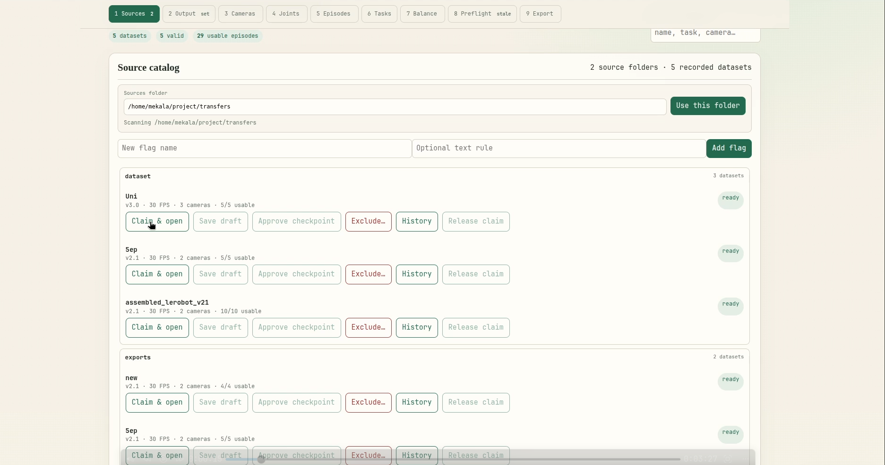 | 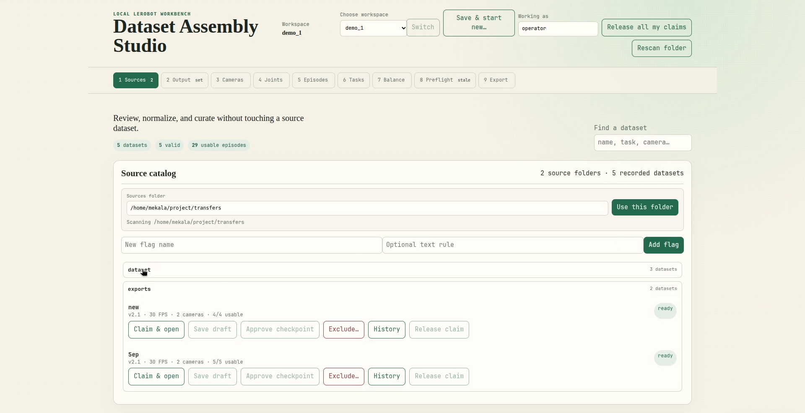 | 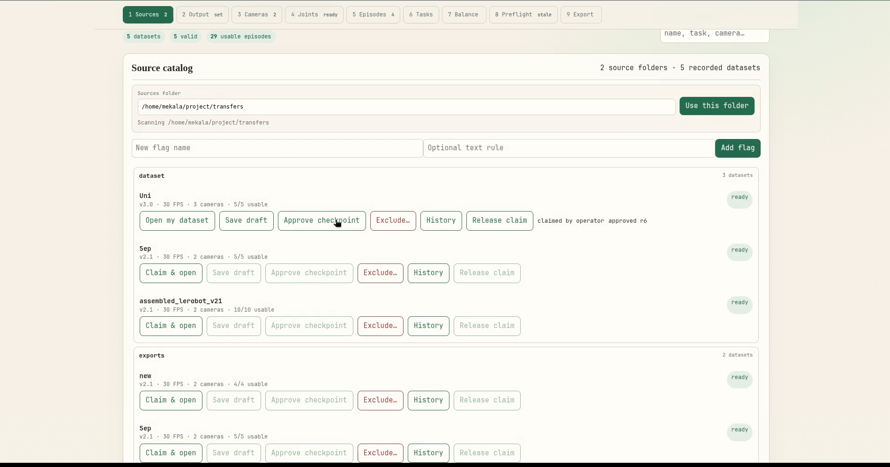

Output | Cameras | Joints
--- | --- | ---
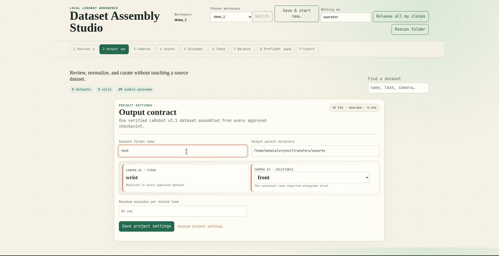 | 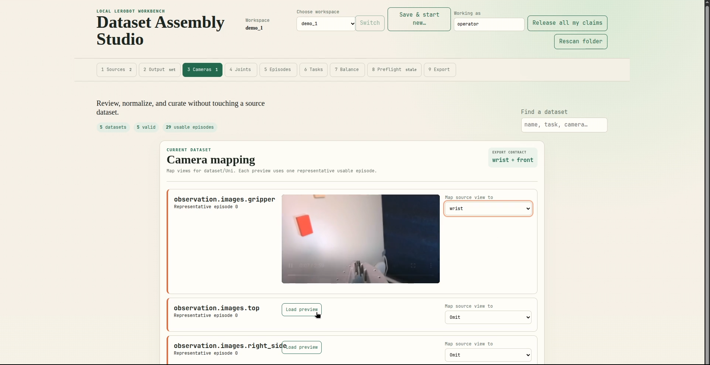 | 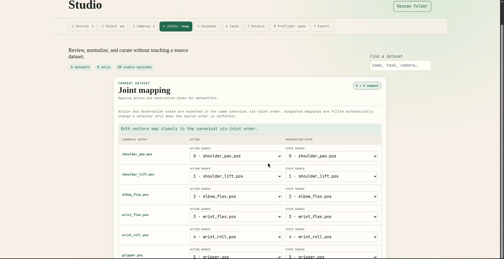

Episodes | Tasks | Balance
--- | --- | ---
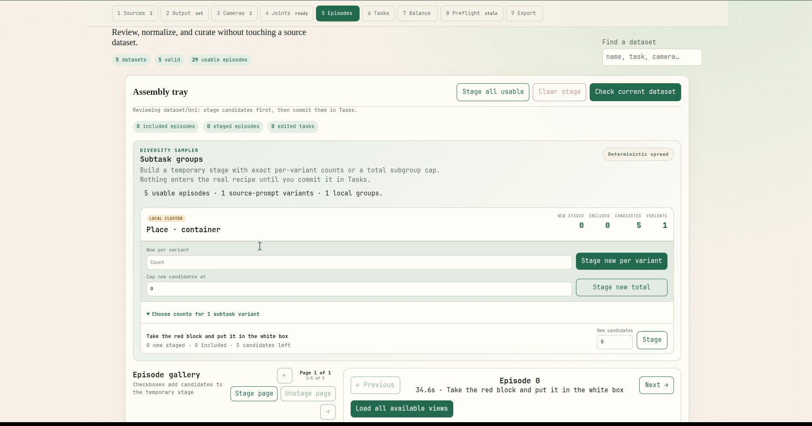 | 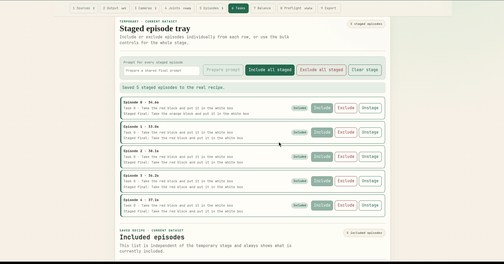 | 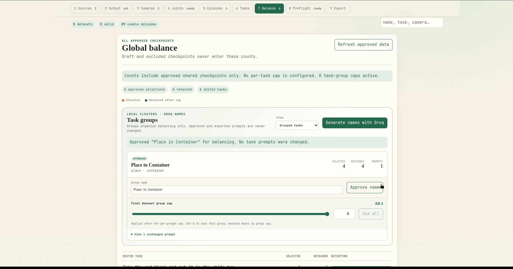

Preflight | Export | Jobs
--- | --- | ---
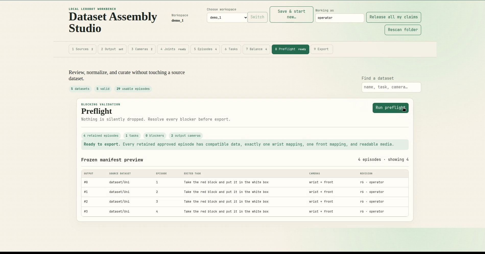 | 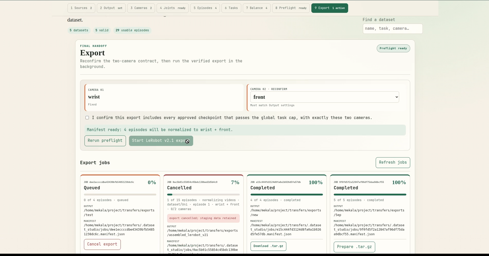 | 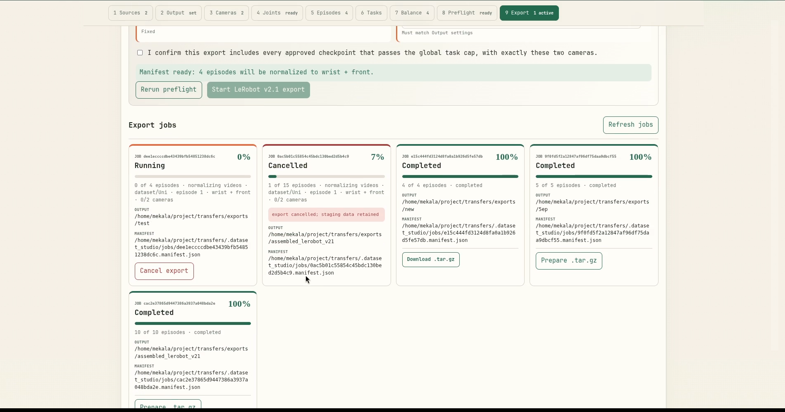

## Quick start

```bash
PYTHONPATH=dataset_studio python -m uvicorn backend.app:app --host 127.0.0.1 --port 8001
```

Then open http://127.0.0.1:8001, set the Sources folder to your dataset root,
and follow the phase tabs: Sources → Output → Cameras → Joints → Episodes →
Tasks → Balance → Preflight → Export.

See `dataset_studio/README.md` for the full guide and `docs/WALKTHROUGH.md`
for a visual walkthrough.

## Configuration

Optional Groq integration for task-group naming. Copy `.env.example` to `.env`
and set `GROQ_API_KEY`. All curation and export features work without it.
